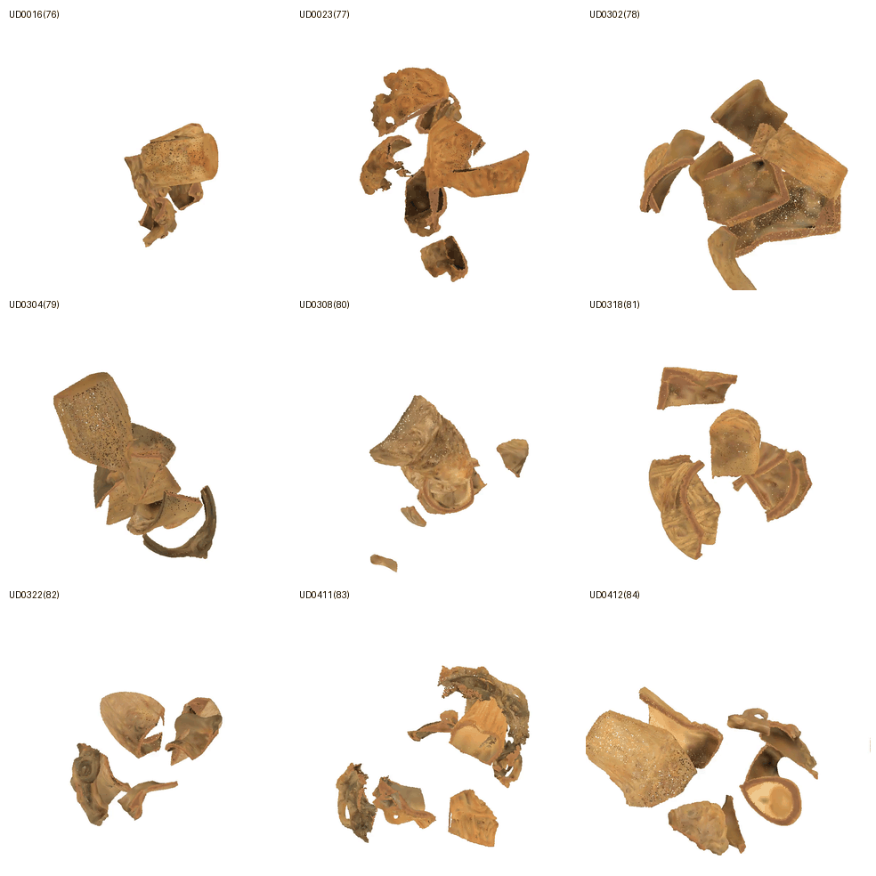
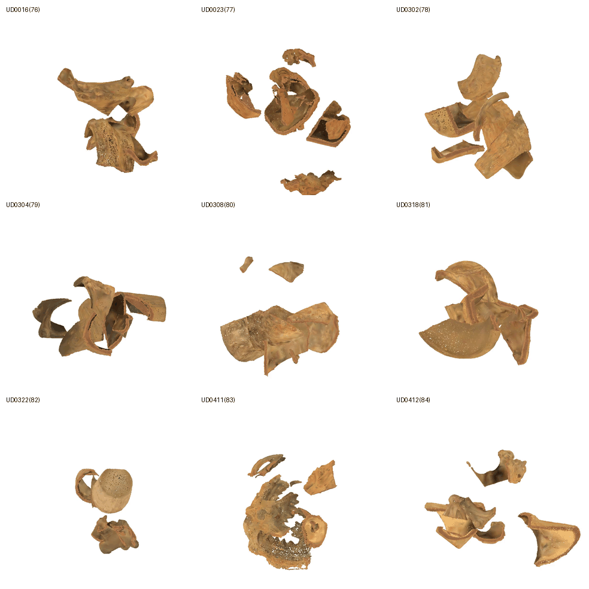
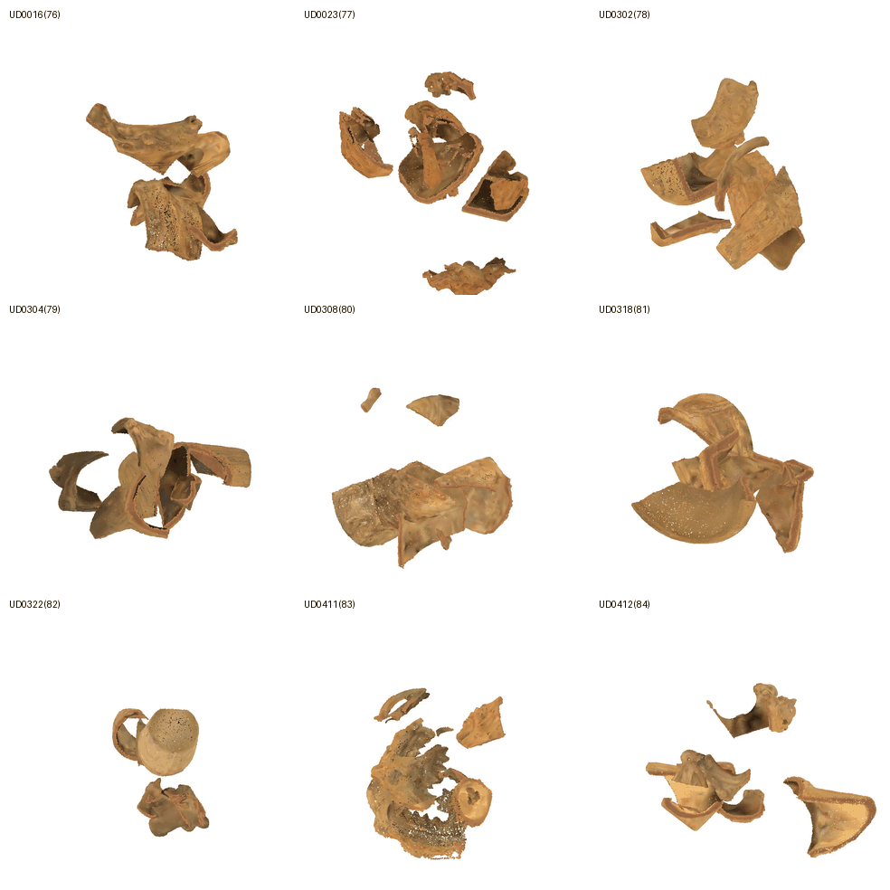

# Jomon Pottery Reassembly with GARF (LoRA Fine-Tuning)

Fragment are generated from 85 Jomon pots, LoRA fine-tune of [**GARF**](https://arxiv.org/abs/2504.05400) on an RTX4070Ti (16GB VRAM),
test inference is run on 10 held-out pots, and render reconstruction videos.

## Visuals & Metrics

| Sampling Method </br> $\text{ }$ | RMSE(Rotation) $\downarrow$ </br> degree | RMSE(Translation) $\downarrow$ </br> $×10^{−2}$ | PA $\uparrow$ </br> % | Chamfer Distance $\downarrow$ </br> $×10^{−3}$ |
| :-- | :-- | :-- | :-- | :-- |
| Furthest Point | 5.44 | 2.33 | 0.97 | 0.66 |
| Weighted Poisson Disk | 5.25 | 2.11 | 0.99 | 0.78 |
| Poisson Disk | **3.33** | **1.46** | **1.000** | **0.58** |

*PA is the percentage of correctly assembled fragments, where the per-fragment chamfer distance is below 0.01*

### Poisson Disk Sampling

**9 of the held out potteries.**

<p align="center">
  
</p>

**Individual reassembly videos for poisson disk sampling**

<table align="center">
  <tr>
    <td width="33%">
      <video src="https://github.com/user-attachments/assets/c00da6dd-b0cf-4cd5-84c8-966efd6ca2ea" controls></video>
    </td>
    <td width="33%">
      <video src="https://github.com/user-attachments/assets/c9216f4f-7705-4d53-b45a-430b207d035f" controls></video>
    </td>
    <td width="33%">
      <video src="https://github.com/user-attachments/assets/fdb8c404-9ab9-4f0a-89bc-8a3343c2b941" controls></video>
    </td>
  </tr>
</table>

### Weighted Poisson Disk Sampling
<details>
<summary>Expand to see Gif</summary>
<p align="center">
  
</p>
</details>

### Furthest Point Sampling
<details>
<summary>Expand to see Gif</summary>
<p align="center">
  
</p>
</details>

</br>

## **Pipeline & architecture diagrams:**

<p align="center">
  
  
</p>

# Usage

## 1. RTX4070Ti Environment (GARF-recommended: `uv`)

```bash
curl -LsSf https://astral.sh/uv/install.sh | sh
cd GARF
uv sync                 # base deps
uv sync --extra post    # flash-attn, pytorch3d, torch-scatter, torch-cluster
source .venv/bin/activate
```

Place the checkpoint [GARF.ckpt](https://github.com/ai4ce/GARF/tree/main#-model-zoo):
```text
GARF/output/GARF.ckpt      # bundles PTv3 feature extractor + Flow-Matching model
```

## 2. LoRA Fine-Tuning

Training reads intact meshes from `pottery/` directly — no preprocessing step.

```bash
cd GARF
chmod +x scripts/train_jomon.sh scripts/infer_jomon.sh
bash scripts/train_jomon.sh      # defaults: POTTERY_DIR=../pottery, GARF_CKPT=output/GARF.ckpt
```

- **Train split:** first 75 objects (sorted). **Held-out:** last 10 (sorted).
- **Output:** `logs/GARF-Jomon/<run>/checkpoints/last.ckpt`.

<details>
<summary><i>Raw command</i></summary>

```bash
python train.py experiment=jomon_finetune data.pottery_dir=../pottery \
    ckpt_path=output/GARF.ckpt finetuning=true \
    model.feature_extractor_ckpt=null trainer.devices=[0]
```
</details>

## 3. Inference on the 10 Held-Out Objects

Base `GARF.ckpt` + your LoRA checkpoint → two-session flow matching.
Inference uses a **fixed seed** per object so fractures are reproducible.

```bash
bash scripts/infer_jomon.sh
```

**Results:** `logs/GARF-Jomon/<run>/json_results/*.json`

## 4. Generate Visuals for Animation

```bash
python src/destruct.py -i pottery -o fragmented_v1 -n 8 --num-samples 50000 --seed 42
```

## 5. Animation + Collage Rendering

```bash
python -m venv .venv-anim
# Windows: .venv-anim\Scripts\activate | Linux/macOS: source .venv-anim/bin/activate
pip install numpy scipy trimesh "imageio[ffmpeg]" pillow torch

# Render MP4s AND build the 3x3 collage GIF
python src/render_local.py --jomon_data ./GARF/fragmented_v1 --results ./GARF/logs/GARF-Jomon/jomon_infer/version_0/json_results --out ./animations --device cuda

# (Optional) rebuild the collage later without re-rendering
python src/render_local.py --collage_only --out ./animations --cell 280
```
